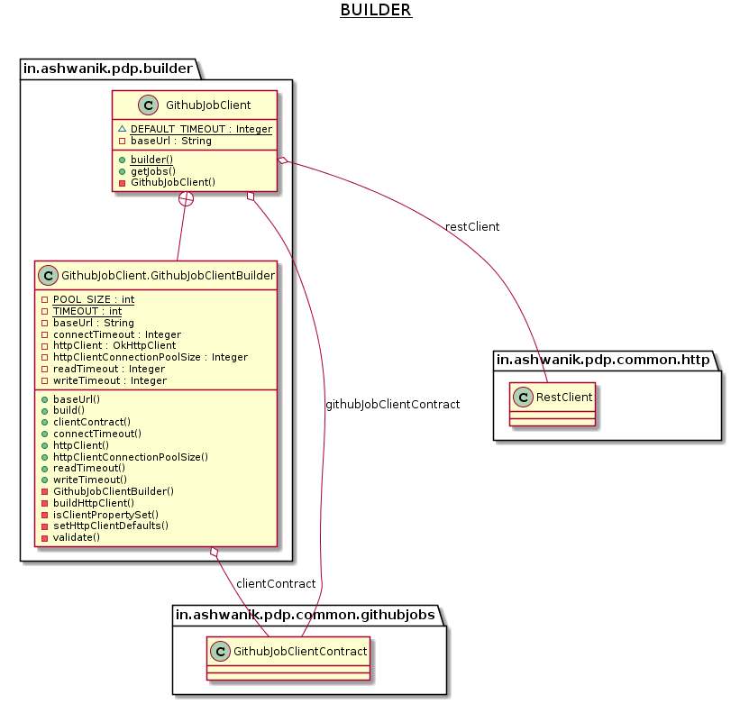

# Builder

**Builder** is a creational design pattern that lets us construct complex objects step by step. 
The pattern allows us to produce different types and representations of an object using the same construction code.

## Examples from Java core libraries

- [java.lang.StringBuilder#append()](http://docs.oracle.com/javase/8/docs/api/java/lang/StringBuilder.html#append-boolean-)
- [java.lang.StringBuffer#append()](http://docs.oracle.com/javase/8/docs/api/java/lang/StringBuffer.html#append-boolean-)
- [java.nio.ByteBuffer#put()](http://docs.oracle.com/javase/8/docs/api/java/nio/ByteBuffer.html#put-byte-) 
- [javax.swing.GroupLayout.Group#addComponent()](http://docs.oracle.com/javase/8/docs/api/javax/swing/GroupLayout.Group.html#addComponent-java.awt.Component-)