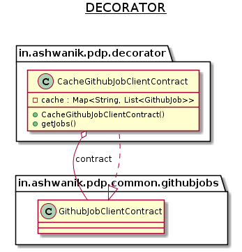

# Decorator

**Decorator** pattern is a design pattern that allows behavior to be added to an individual object, dynamically, without affecting the behavior of underlying object from the same class.

## Examples from Java core libraries

- All subclasses of [java.io.InputStream](http://docs.oracle.com/javase/8/docs/api/java/io/InputStream.html), [OutputStream](http://docs.oracle.com/javase/8/docs/api/java/io/OutputStream.html), [Reader](http://docs.oracle.com/javase/8/docs/api/java/io/Reader.html) and [Writer](http://docs.oracle.com/javase/8/docs/api/java/io/Writer.html) have a constructor taking an instance of same type.
- [java.util.Collections](http://docs.oracle.com/javase/8/docs/api/java/util/Collections.html), the [checkedXXX()](http://docs.oracle.com/javase/8/docs/api/java/util/Collections.html#checkedCollection-java.util.Collection-java.lang.Class-), [synchronizedXXX()](http://docs.oracle.com/javase/8/docs/api/java/util/Collections.html#synchronizedCollection-java.util.Collection-) and [unmodifiableXXX()](http://docs.oracle.com/javase/8/docs/api/java/util/Collections.html#unmodifiableCollection-java.util.Collection-) methods.
- [javax.servlet.http.HttpServletRequestWrapper](http://docs.oracle.com/javaee/7/api/javax/servlet/http/HttpServletRequestWrapper.html) and [HttpServletResponseWrapper](http://docs.oracle.com/javaee/7/api/javax/servlet/http/HttpServletResponseWrapper.html)
- [javax.swing.JScrollPane](https://docs.oracle.com/javase/7/docs/api/javax/swing/JScrollPane.html)
