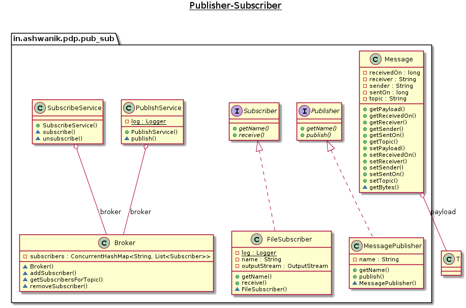

# Publisher-Subscriber

**Publisher-Subscriber** is a messaging pattern where senders of messages, called publishers, do not program the messages to be sent directly to specific receivers, called subscribers, but instead categorize published messages into classes without knowledge of which subscribers, if any, there may be. Similarly, subscribers express interest in one or more classes and only receive messages that are of interest, without knowledge of which publishers, if any, there are.

### References
- [Wiki](https://en.wikipedia.org/wiki/Publish%E2%80%93subscribe_pattern)